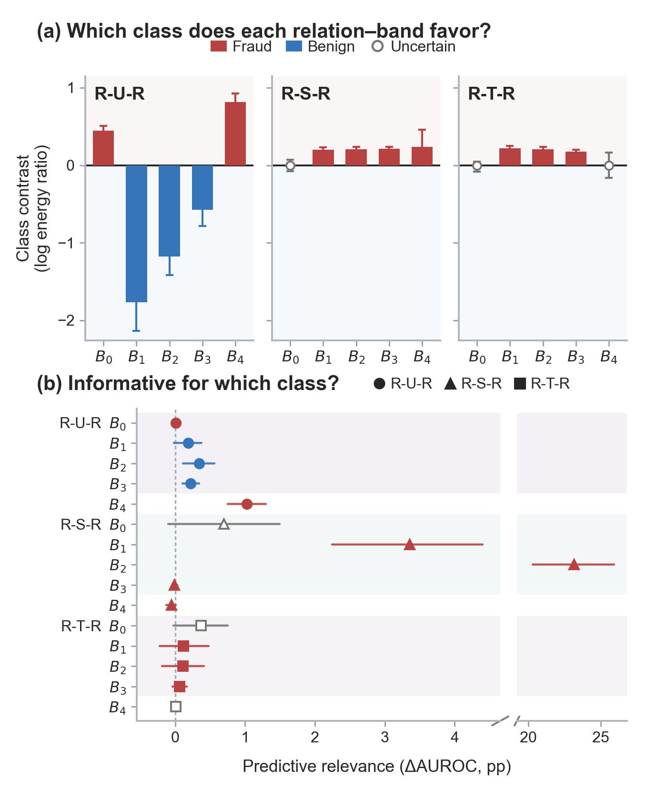

<div align="center">

# SOAR

**S**igned **O**rientation-**A**ware **R**esidual for graph fraud detection

[](LICENSE)
[](requirements.txt)
[](https://pytorch.org)

[Overview](#overview) ·
[Results](#results) ·
[Setup](#setup) ·
[Reproduce](#reproduce) ·
[Citation](#citation)



<sub>Frequency importance does not specify which class a relation–band supports.</sub>

</div>

Official implementation of

> **Beyond Band Importance: Signed Orientation-Aware Spectral Learning for Graph Fraud Detection**

Spectral fraud detectors typically ask *which frequencies are informative*. SOAR additionally asks **which class each relation–band favors**, how reliable that orientation is under limited labels, and how to keep the corresponding evidence from being mixed away during representation learning.

`--dataset` together with `--abundant` or `--scarce` selects the paper recipe in [`configs/paper.json`](configs/paper.json). Hyperparameters, graph mode, feature transform, and the T-Social 0.01% scarce split are filled in automatically.

## Overview

SOAR estimates a class orientation for every relation–band from label-free spectral energy profiles and training labels, then injects that orientation **in-band** as a signed residual. A parallel orientation-neutral path retains spectral information when the estimated direction is uncertain. Directional consistency regularizes the hidden class contrast toward the fixed orientation reference.

| Paper object | Implementation |
| --- | --- |
| Energy profiles $q_{i,r,s}$ | `soar.energy_profiles` |
| Orientation $\mathbf{o}_r$, reliability $\rho_r$ | `soar.calibrate_orientation` |
| In-band signed residual and dual-path readout | `soar.SOAR` |
| Directional consistency $\mathcal{L}_{\mathrm{DC}}$ | `soar.directional_consistency_loss` |
| Frozen BWGNN split | `protocol.py` |
| Validation-only epoch / threshold selection | `train.py` |

Matched controls (`--variant`):

| Variant | What it tests |
| --- | --- |
| `full` | SOAR |
| `magnitude` | unsigned $\lvert\mathbf{o}\rvert$; shared head; DC off |
| `orientation_off` | no signed residual ($\rho=0$) |
| `reliability_off` | unit weight on resolved relations |
| `signed_only` | drop the orientation-neutral path |

## Results

AUROC / Macro-F1 (%), mean \(\pm\) population SD over **fixed-split reinitializations**. These are the paper-table entries, not a claim that one seed must match them.

| Supervision | YelpChi | Amazon | T-Finance | T-Social |
| --- | ---: | ---: | ---: | ---: |
| 40% labels | $92.28\pm0.17$ / $79.30\pm0.23$ | $97.82\pm0.19$ / $93.02\pm0.32$ | $97.10\pm0.73$ / $92.23\pm0.88$ | $99.12\pm0.02$ / $94.98\pm0.19$ |
| 1% labels<sup>†</sup> | $78.21\pm0.60$ / $67.07\pm0.39$ | $91.83\pm1.05$ / $90.05\pm0.64$ | $95.05\pm0.68$ / $90.75\pm0.28$ | $94.34\pm0.98$ / $85.13\pm0.54$ |

<sup>†</sup>T-Social scarce uses 0.01% training labels. Paper tables use ten reinitializations except T-Social (five abundant, four scarce). `--10-seeds` always launches ten runs.

Baselines in the paper are **published references**, not matched reruns. Amazon scarce uses a disclosed recipe (concat fusion, shared two-class head, band-confidence refinement) that `--scarce` routes in automatically.

## Setup

```bash
python -m venv .venv
source .venv/bin/activate
pip install -r requirements.txt
```

Install a CUDA build of [PyTorch](https://pytorch.org/get-started/locally/) that matches your driver **before** `requirements.txt` if you train on GPU. DGL is required only for T-Finance and T-Social.

```bash
python train.py --smoke
```

## Data

Datasets are **not** redistributed. Place them under `data/`:

| Dataset | Path | Source |
| --- | --- | --- |
| YelpChi | `data/YelpChi.mat` | [BWGNN](https://github.com/squareRoot3/Rethinking-Anomaly-Detection) |
| Amazon | `data/Amazon.mat` | same |
| T-Finance | `data/tfinance` | DGL binary from BWGNN / DGL fraud graphs |
| T-Social | `data/tsocial` | same |

Splits are written on the first training run (split seed **2**, never a training seed). To materialize all eight frozen splits:

```bash
python protocol.py --all
```

Protocol invariants:

- Both stratified draws use split seed `2`.
- Amazon nodes `0–3304` remain in the graph but are ineligible for train/val/test.
- Abundant: 40% train. Scarce: 1% (T-Social 0.01%). Of the remainder, 33% val / 67% test.
- Epoch and threshold are selected on **validation Macro-F1** over `linspace(0.05, 0.95, 19)`. Test labels are used only after that lock.
- Orientation statistics are estimated from **training labels only** and stay fixed during optimization.

## Reproduce

One dataset, one regime, paper hyperparameters:

```bash
python train.py --dataset yelpchi --abundant
python train.py --dataset yelpchi --scarce --10-seeds
python train.py --dataset amazon --scarce --10-seeds
python train.py --dataset tfinance --abundant --10-seeds
python train.py --dataset tsocial --scarce --10-seeds --device cuda:0
```

`--abundant` / `--scarce` pick the paper cell. `--10-seeds` runs the ten-reinitialization protocol. A single run is the default (`--seed` if you need a specific reinitialization).

Ablations reuse the same recipe:

```bash
python train.py --dataset yelpchi --abundant --10-seeds --variant orientation_off
```

Outputs land in `outputs/<dataset>-<regime>/`. After a multi-run job, `summary.json` reports mean ± population SD next to the paper numbers.

```bash
python scripts/summarize.py outputs/yelpchi-abundant
```

T-Social uses streamed Bernstein bands (plan for ~24 GB GPU memory). Amazon scarce, hetero/homo graph mode, and feature transforms are not flags you need to remember — they are in the cell config.

Inspect a recipe without training:

```bash
python train.py --dataset amazon --scarce --10-seeds --dry-run
```

## Repository

```text
train.py                public entry: --dataset --abundant/--scarce --10-seeds
soar.py                 model, orientation, directional consistency
protocol.py             frozen BWGNN split (seed 2); T-Social --scarce → 0.01%
data.py                 graph I/O, features, metrics
configs/paper.json      main-table recipes (auto-routed)
scripts/summarize.py    mean ± population SD over result JSON
manuscript/             TeX, bibliography, figures, numeric archive
```

## Scope

- This is a paper-reproduction codebase, not a general-purpose GNN library.
- Graph modes in the main tables: YelpChi and Amazon **hetero** (relations retained); T-Finance and T-Social **homo**.
- Amazon scarce is a disclosed configuration variant, not a silent change of the core method.
- Optional `--S`, `--lam`, `--beta`, … flags override a cell; they are not required for reproduction.

## Citation

```bibtex
@article{tian2026soar,
  title   = {Beyond Band Importance: Signed Orientation-Aware Spectral Learning for Graph Fraud Detection},
  author  = {Tian, Chunwei and Meng, Qi},
  journal = {IEEE Transactions on Knowledge and Data Engineering},
  year    = {2026},
  note    = {Manuscript}
}
```

See also [`CITATION.cff`](CITATION.cff).

## License

MIT. See [`LICENSE`](LICENSE).
